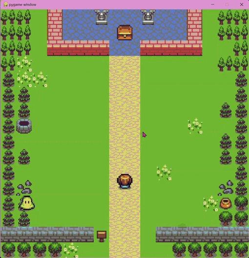

# 🕹️🎮 Python Retro Arcade

A retro arcade-style game developed in **Python** using the **Pygame** library. The player's goal is to dodge moving enemies and reach the treasure chest to accumulate victories and progressively increase the difficulty.

## Game Preview

<p align="center">
  
</p>

## Game Features
* **Progressive Difficulty:** Every 2 victories, enemy speed increases and more challenges appear on screen.
* **Audio Management:** General background music and independent sound effects (success, collision, and final victory) managed through dedicated audio channels.
* **Victory / Game Over Screen:** Upon completing the required rounds, a custom logo is displayed with a quick-restart option via interactive button or keyboard.
* **Visual Counter:** System for tracking and displaying collected coins and victories.

## 🛠️ Technologies and Requirements
* **Python** (version 3.x recommended)
* **Pygame**

## Installation and Execution

1. Clone this repository or download the files to your computer:
   ```bash
   git clone [https://github.com/ArizdelcyLizbeth/python-retro-arcade.git](https://github.com/ArizdelcyLizbeth/python-retro-arcade.git)
   
